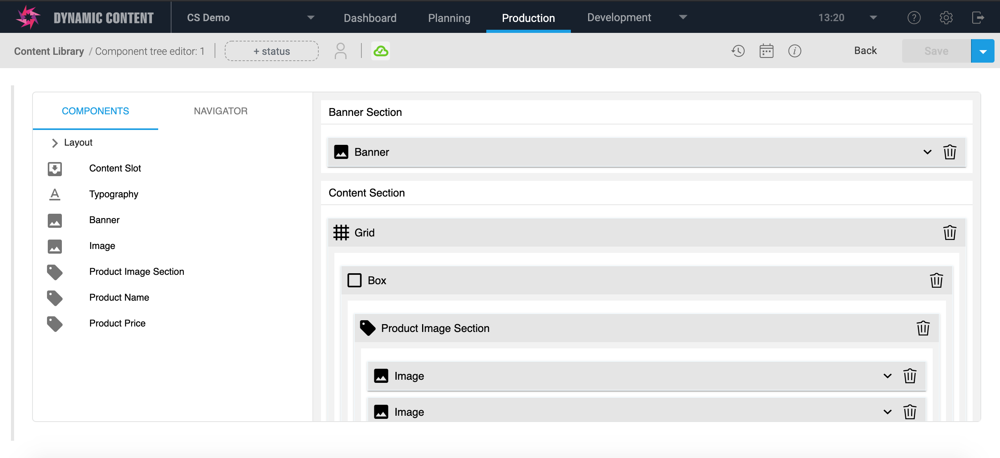

[](https://amplience.com/dynamic-content)



# dc-extension-dom

> Tree field component for use in [Amplience Dynamic Content](https://amplience.com/dynamic-content)


## Usage

This extension can be used to create and edit a hierarchy of components. They have properties and might be treated as slots with children.

### Example Schema

```json
{
	"$schema": "http://json-schema.org/draft-07/schema#",
	"$id": "...",
	"title": "DOM",
	"description": "",
	"allOf": [
		{
			"$ref": "http://bigcontent.io/cms/schema/v1/core#/definitions/content"
		}
	],
	"type": "object",
	"properties": {
		"layout": {
			"type": "object",
			"ui:extension": {
				"name": "dc-extension-dom",
				"params": {
					"height": 300,
					"slots": {
						"children": {
							"title": "A",
							"allow": "*"
						},
						"items": {
							"title": "B",
							"allow": ["image"]
						}
					},
					"components": [
						{
							"name": "box",
							"title": "Box",
							"icon": "crop_din",
							"properties": {},
							"infoLink": "https://amplience.com",
							"group": "Group1",
							"slots": {
								"children": {
									"allow": ["image"]
								}
							}
						},
						{
							"name": "grid",
							"title": "Grid",
							"icon": "grid_4x4",
							"group": "Group2",
							"properties": {
								"direction": {
									"type": "string",
									"title": "Direction",
									"enum": [
										"row", "row-reverse", "column", "column-reverse"
									]
								}
							},
							"slots": {
								"children": {
									"allow": "*"
								}
							}
						},
						{
							"name": "typography",
							"title": "Typography",
							"icon": "text_format",
							"properties": {
								"variant": {
									"type": "string",
									"title": "Variant",
									"enum": [
										"h1", "h2", "h3", "h4", "h5", "h6", "body1", "body2"
									]
								},
								"text": {
									"type": "string",
									"title": "Text"
								}
							},
							"preview": {
								"text": "/text"
							},
							"slots": {
							}
						},
						{
							"name": "image",
							"title": "Image",
							"icon": "image",
							"properties": {
								"image": {
									"allOf": [
										{
											"$ref": "http://bigcontent.io/cms/schema/v1/core#/definitions/image-link"
										}
									]
								}
							},
							"slots": {
							}
						},
						{
							"name": "product_image",
							"title": "Product Image",
							"icon": "sell",
							"properties": {
								"variant": {
									"type": "string",
									"enum": ["full-width", "column"]
								}
							},
							"slots": {
							}
						},
						{
							"name": "product_name",
							"title": "Product Name",
							"icon": "sell",
							"properties": {
								"variant": {
									"type": "string",
									"title": "Variant",
									"enum": [
										"h1", "h2", "h3", "h4", "h5", "h6", "body1", "body2"
									]
								}
							},
							"slots": {
							}
						},
						{
							"name": "product_price",
							"title": "Product Price",
							"icon": "sell",
							"properties": {
							},
							"slots": {
							}
						},
						{
							"name": "content_slot",
							"title": "Content Slot",
							"icon": "move_to_inbox",
							"properties": {
							},
							"slots": {
							}
						}	
					]
				}
			}
		}

	},
	"propertyOrder": []
}
```

## Advanced

### Parameters

* ```"name"``` property can be used to define render for each type of node.

* ```"icon"``` - value from [Material icons](https://fonts.google.com).

* ```"infoLink"``` - valid external lint to usefull notes.

* ```"group"``` - name to group components.

* ```"slots"``` may contain properties designed in a same way.

Example:

```json
{
    "name": "box",
    "title": "Box",
    "icon": "crop_din",
    "properties": {},
    "infoLink": "https://amplience.com",
    "group": "Group1",
    "slots": {
        "children": {
            "allow": ["image"]
        }
    }
}
```

### Preview

Add "preview" configuration to preview filled out text and images. Value should be JSON path to properties. Images will be previewed automatically or pass value to ```"image"``` property.

Example: 

```json
{
    "name": "typography",
    "title": "Typography",
    "icon": "text_format",
    "properties": {
        "variant": {
            "type": "string",
            "title": "Variant",
            "enum": [
                "h1", "h2", "h3", "h4", "h5", "h6", "body1", "body2"
            ]
        },
        "text": {
            "type": "string",
            "title": "Text"
        }
    },
    "preview": {
        "text": "/text"
    },
    "slots": {
    }
}
```

### Properties

Properties should be defined same as in regular DC schema. Listings and extensions are not supported.

### Validation

To enable validation, pass ```"allow": ["image"]``` to enable drop to slots only specific types of components or ```"allow": "*""``` to allow all.

### Register Extension

This extension needs to be [registered](https://amplience.com/docs/development/registeringextensions.html) against a Hub with in the Dynamic Content application (Developer -> Extensions), for it to load within that Hub.

* Category: Content Field
* Label: DOM Extension
* Name: dc-extension-dom _(needs to be unique with the Hub)_
* URL: [https://dom.extensions.content.amplience.net](https://dom.extensions.content.amplience.net)
* Description: DOM editor _(can be left blank, if you wish)_

Note:
You can use our deployed version of this extension (builds from the "production" branch) -

[https://dom.extensions.content.amplience.net](https://dom.extensions.content.amplience.net)

_As this is an open source project you're welcome to host your own "fork" of this project. You can use any standard static hosting service (Netlify, Amplify, Vercel, etc.) if you wish._

### How to run
To run storybook:
```javascript
npm run storybook
```

To run locally:
```javascript
npm run start
```

## License

Licensed under the Apache License, Version 2.0 (the "License");
you may not use this file except in compliance with the License.
You may obtain a copy of the License at

    http://www.apache.org/licenses/LICENSE-2.0

Unless required by applicable law or agreed to in writing, software
distributed under the License is distributed on an "AS IS" BASIS,
WITHOUT WARRANTIES OR CONDITIONS OF ANY KIND, either express or implied.
See the License for the specific language governing permissions and
limitations under the License.
