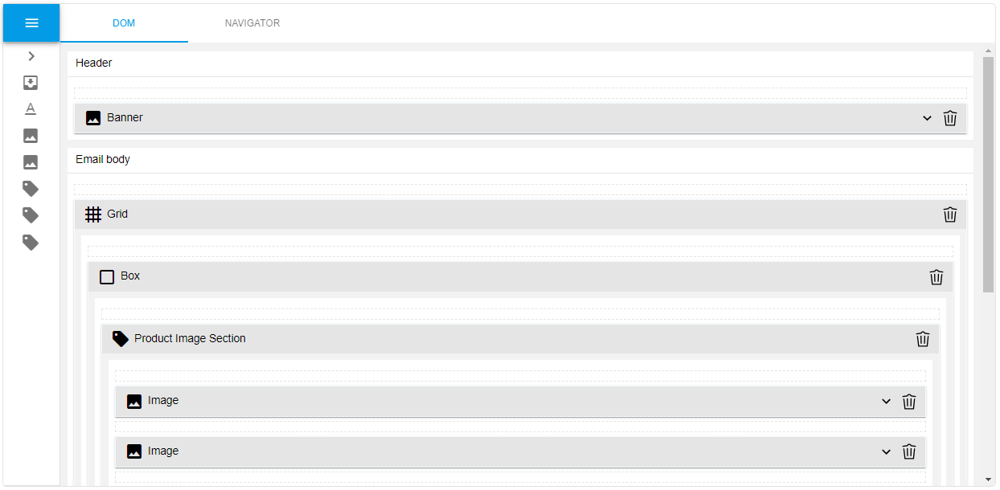
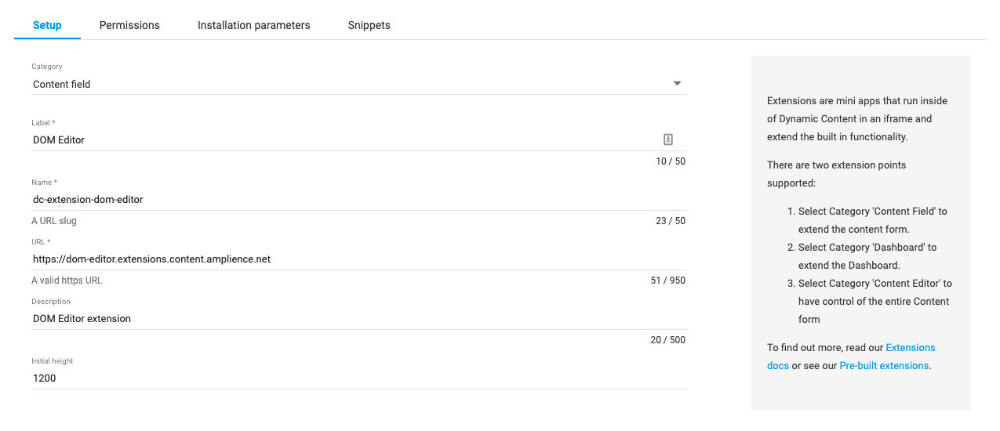

# dc-extension-dom-editor



The DOM Editor extension allows content authors to create and edit a hierarchy of components to structure their content in an abstract manner, for use in a Document Object Model.

## How to install

This extension can optionally be [registered](https://amplience.com/docs/development/registeringextensions.html) against a Hub with in the Dynamic Content application (Developer -> Extensions), to allow it to load within that Hub.

### Register Extension



* Category: Content Field
* Label: DOM Editor
* Name: dc-extension-dom-editor _(needs to be unique with the Hub)_
* URL: [https://dom-editor.extensions.content.amplience.net](https://dom-editor.extensions.content.amplience.net)
* Description: DOM Editor extension _(can be left blank, if you wish)_
* Initial height: 1200

Note: You can use our deployed version of this extension (builds from the "production" branch) - [https://dom-editor.extensions.content.amplience.net](https://dom-editor.extensions.content.amplience.net)

_As this is an open source project you're welcome to host your own "fork" of this project. You can use any standard static hosting service (Netlify, Amplify, Vercel, etc.) if you wish. Further information can be found on the [Hosting](HOSTING.md) page._

To use the DOM Editor, you first need to add a field to your content type schema that is configured to use the DOM Editor extension.

### Assign the extension to schema

If you have registered your extension as detailed above, you then simply need to add a field to your content type schema that is configured to use the DOM Editor extension.

```json
"propertyName": {
  "type": "object",
  "ui:extension": {
    "name": "dc-extension-dom-editor",
    "params": {
      "slots": {},
      "components": []
    }
  }
}
```

It is also possible to to add an instance of the extension to a content type schema without first registering it. This can be done by referencing the extension by its URL instead of its name.

```json
"propertyName": {
  "type": "object",
  "ui:extension": {
    "url": "https://dom-editor.extensions.content.amplience.net",
    "params": {
      "slots": {},
      "components": []
    }
  }
}
```

## Configuration

You can then configure your instance of the DOM Editor with slots and their allowable components. These should be added to the `params` object in your `ui:extension` field.

### Slots:

```json
"slotName": {
  "title":"string",
  "allow": []
}
```

| Property | Format                         | Description                                                  |
| -------- | ------------------------------ | ------------------------------------------------------------ |
| title    | string                         | The title of the slot.<br />If not defined, the title will default to the property name.<br />If 2 or more slots are defined at the same level, the title will be displayed within the extension. |
| allow    | string OR array,<br />required | Defines which [components](#components) can be added to this slot.<br />Contains component names as an array of strings.<br />Use `"*"` if you want all components to be valid children. |

#### Example slots:

##### Slot which can contain only specific components

```json
"header": {
  "title":"Header",
  "allow": [
    "header-link",
    "header-inline"
  ]
}
```

##### Slot which can contain any components

```json
"body": {
  "title":"Body",
  "allow": "*"
}
```

### Components:

```json
{
  "name": "string",
  "title": "string",
  "group": "string",
  "infoLink": "string",
  "icon": "string",
  "properties": {},
  "preview": {},
  "slots": {}
}
```

| Property   | Format                | Description                                                  |
| ---------- | --------------------- | ------------------------------------------------------------ |
| name       | string,<br />required | The name of the component.<br />Used to identify the component within the schema, and for adding as an allowed component to a slot. |
| title      | string                | The friendly label of the component.<br />The title will be shown in the component's top bar within the extension. |
| group      | string                | The name of a group under which this component will be categorised.<br />All components with a matching group will show under the same group in the extension.<br />If no group is provided, this component will display at the top level of the component tray. |
| infoLink   | string                | A link to an external resource.<br />Can be used for providing documentation for your custom components. |
| icon       | string                | A custom icon for the component for easier identification.<br />Will accept [Material Icons](https://fonts.google.com/icons?selected=Material+Icons+Outlined) by name (eg `"image"`), or a custom image as a URL.<br />If no value provided, will default to `settings` Material icon. |
| properties | object                | Defines child content field properties for this component.<br />[Supported content field properties](#supported-content-field-properties). |
| preview    | object                | Defines text previews for this component.<br />Provided as a relative path to the text property within the component you wish to preview. |
| slots      | object                | Defines child [slots](#slots) for this component.<br />Cannot backreference slots defined at a higher level. |

#### Supported content field properties

| Type    | Description                                                  |
| ------- | ------------------------------------------------------------ |
| string  | A string of text that may contain unicode characters.<br />Supports the `enum` validation keyword, and `default` keyword.<br />Supports the `color` format, which will produce a color picker in the extension UI. |
| number  | Any numeric type. It can be an integer or floating point number.<br />Supports the `enum` validation keyword, and `default` keyword. |
| boolean | A value that can be true or false.<br />Supports the `default` keyword. |
| object  | A JSON object. Supports a $ref to the following Dynamic Content [choosers](https://amplience.com/docs/integration/choosers.html#using-the-schema-editor-to-add-media-and-content-links):<br />`http://bigcontent.io/cms/schema/v1/core#/definitions/image-link`<br />`http://bigcontent.io/cms/schema/v1/core#/definitions/content-link`<br />`http://bigcontent.io/cms/schema/v1/core#/definitions/content-reference` |

#### Example components:

Below are some example components which are loosely associated to one-another, to help you get started.

##### A basic component with no child properties

```json
{
  "name": "header-link",
  "title": "Basic Component"
}
```

##### Grouped component with content-link property

```json
{
  "name": "header-link",
  "title": "Header (Content-Link)",
  "icon": "view_headline",
  "group": "DC Links",
  "properties": {
    "content": {
      "title": "Header",
      "allOf": [
        {
          "$ref": "http://bigcontent.io/cms/schema/v1/core#/definitions/content-link"
        },
        {
          "properties": {
            "contentType": {
              "enum": [
                "https://example.com/schemaUri.json"
              ]
            }
          }
        }
      ]
    }
  }
}
```

##### Grouped component with image-link property

```json
{
  "name": "simple-image",
  "title": "Image",
  "icon": "image",
  "group": "DC Links",
  "properties": {
    "image": {
      "title": "Image",
      "description": "A simple Amplience Image-Link",
      "allOf": [
        {
          "$ref": "http://bigcontent.io/cms/schema/v1/core#/definitions/image-link"
        }
      ]
    }
  }
}
```

##### Component with multiple inline properties & text preview

```json
{
  "name": "copy-stack",
  "title": "Copy Stack",
  "icon": "horizontal_split",
  "properties": {
    "headline": {
      "title": "Headline",
      "description": "A short headline.",
      "type": "string"
    },
    "headline-size": {
      "title": "Headline Size",
      "type": "string",
      "enum": [
        "h1",
        "h2",
        "h3",
        "h4",
        "h5",
        "h6"
      ]
    },
    "support-copy": {
      "title": "Support Copy",
      "description": "A longer description.",
      "type": "string"
    }
  },
  "preview": {
    "text": "/headline"
  }
}
```

##### Component with its own generic slot

```json
{
  "name": "container",
  "title": "Container",
  "icon": "inventory_2",
  "slots": {
    "children": {
      "allow": "*"
    }
  }
}
```

##### Component with named & labelled slots

```json
{
  "name": "split-block",
  "title": "Split Block",
  "icon": "inventory_2",
  "slots": {
    "image": {
      "title": "Image",
      "allow": "simple-image"
    },
    "copy-stack": {
      "title": "Copy Stack",
      "allow": "*"
    }
  }
}
```
